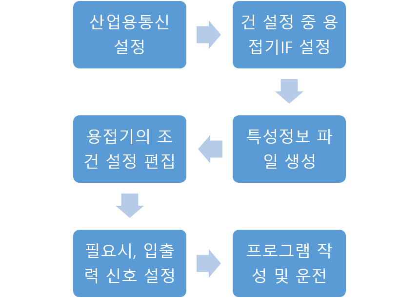

# 6.1.4 조작 순서

용접기 인터페이스의 조작은 산업용 통신 설정부터 시작하여 용접기의 용접조건 편집, 스폿용접 설정 화면에서 입출력 신호 설정, 타이머 사양에 따른 PLC 프로그램 작성, 로봇 프로그램(job) 작성의 순서로 이루어집니다.

 

</img>
<em>
그림 6.4 조작 순서도
</em>


 * 디바이스넷 설정을 위한 산업용 통신 설정은 [**산업용통신 기능 설명서**](https://hrbook-hrc.web.app/#/view/doc-industrial-communication/ko/README?cont_model=${cont_model})를 참고바랍니다.



