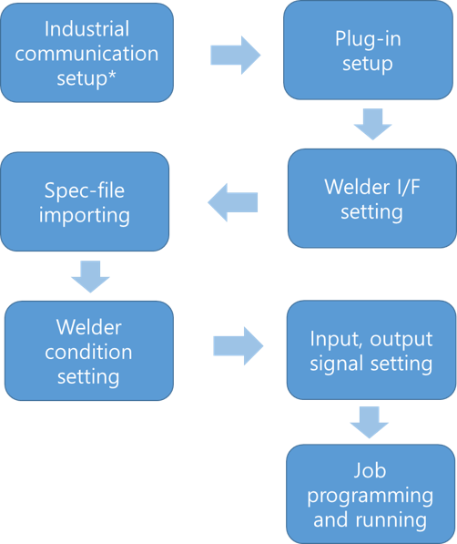

### 6.1.4 Operating Procedure

Operation of the welder interface proceeds in the following order:

- Industrial communication configuration, starting with DeviceNet settings

- Editing welding conditions on the welder

- Configuring input/output signals on the Spot Welding Setup screen

- Creating PLC programs according to the timer specifications

- Creating robot programs (jobs)

 

</img>
<em>
Figure 6.4 Operation Flow
</em>



 * For industrial communication settings required for DeviceNet configuration, refer to [**Industrial Communication Function Manual**](https://hrbook-hrc.web.app/#/view/doc-industrial-communication/english/README)



