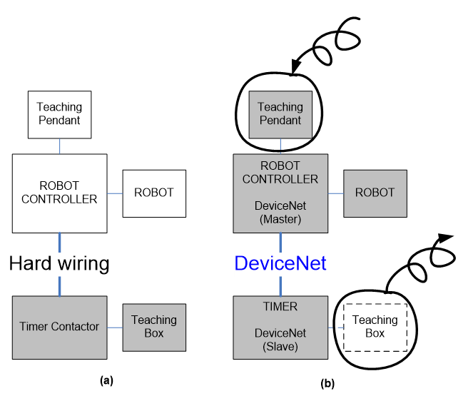

# 6.1 용접기 인터페이스 개요

디바이스넷 통신을 통해 로봇 제어기가 스폿용접 타이머를 통합제어하는 기능입니다. Hi6제어기와 스폿용접기는 디바이스넷 통신을 통해 데이터를 상호 공유 합니다.   

로봇제어기와 스폿용접 타이머를 하나로 구성하여 Hi6 TP를 이용하여 용접 프로그램 편집 및 파일관리가 가능합니다. 
로봇 제어기는 스폿용접 타이머의 주요 기능인 용접 스케줄 프로그래밍, 스텝퍼 프로그래밍, 용접결과 모니터링, 이력파일 관리 등 용접기 티칭박스(Teaching Box)에서 수행하는 주요 기능을 로봇 제어기의 티칭펜던트(Teaching Pendant)에서 수행합니다.  

즉 독립형 용접기의 조작반인 티칭박스(Teaching Box)의 기능을 로봇 티칭펜던트에서 수행 가능하도록 사용자 인터페이스(User interface)를 제공하며 용접 결과 및 각종 신호, 오류 고장의 상태를 표시 모니터링(Monitoring) 합니다.  

로봇제어기와 타이머간 통신은 디바이스넷을 사용합니다. 로봇 제어기는 마스터 이고, 타이머가 슬레이브로 구성됩니다.

</img>
<em>
그림 6.1 (a) 용접기와 분리된 스폿 용접 시스템   (b) 통합 스폿 용접 시스템
</em>

