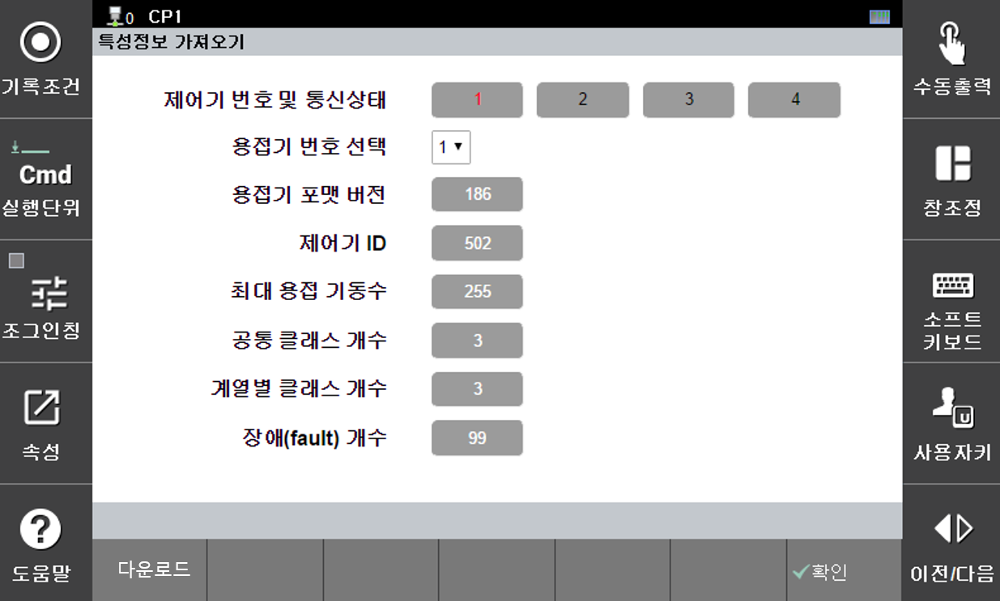

# 6.2.1.1 Importing Characteristic Data

 

</img>
<em>
Figure 6.5 Characteristic Data Import Screen
</em>

  

The characteristic data is essential information that must be prepared in advance in order to use the welder interface functions.
It contains the structure of the welder’s configuration data, menu composition, and other necessary elements.
All functions of the welder interface require this characteristic data.

 

The functions of each part of the screen shown in Figure 6.5 are as follows:
- ① Welder Status: Indicates the ON/OFF-LINE status of the welder.
Red indicates ON-LINE, and black indicates OFF-LINE.

- ② [Select Welder Number]: Enter the number of the welder from which the characteristic data will be downloaded.

- ③ Characteristic Data: Displays characteristics related to the current welder using the downloaded characteristic data.

- ④ [Download] Button: Downloads the characteristic data of the welder specified in [Select Welder Number].
When the download is completed successfully, a message saying “Characteristic data has been saved.” will appear.
