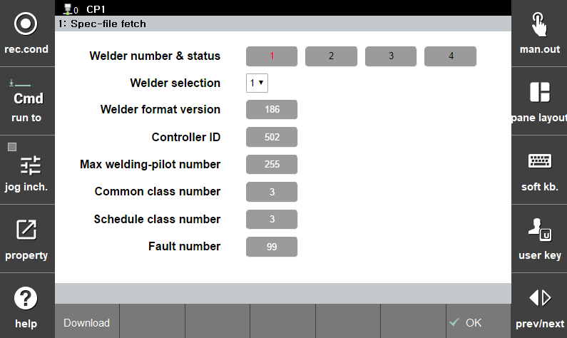

### 6.2.1.1 导入特性数据

 

</img>
<em>
图 6.5 特性数据导入界面
</em>

 

特性数据是使用焊接机接口功能前必须提前准备的基本信息。
它包含焊接机配置数据的结构、菜单组成及其他必要元素。
焊接机接口的所有功能都需要这些特性数据。

 

图 6.5 中显示的屏幕各部分功能如下：
- ① 焊接机状态：指示焊接机的在线/离线状态。
红色表示在线，黑色表示离线。

- ② 焊接机选择：从中选择要下载特性数据的焊接机编号。

- ③ 特性数据：使用下载的特性数据显示与当前焊接机相关的特性。

- ④ `[Download]` 按钮：下载在 [Select Welder Number] 中指定的焊接机的特性数据。
当下载成功完成时，会出现一条消息说“特性数据已保存。”