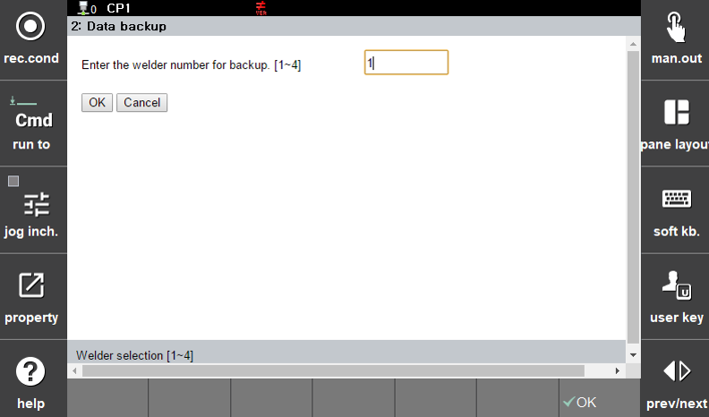

#### 6.2.1.2 Data Backup

 

</img>
<em>
Figure 6.6 Data Backup
</em>

 

The Data Backup function is used when you want to back up the welder's configuration data to the ${cont_model} controller.
Enter the number of the welder from which the data will be retrieved, then press OK to start the backup.
The process takes approximately 1 to 2 minutes.
Once the backup is completed, a message will appear stating: "Data has been successfully backed up."

The backed-up data can be effectively used in the following cases:

- ① When you want to store a backup of the welder's configuration values

- ② When you want to modify the data of another welder connected to the ${cont_model} controller

- ③ When you want to apply batch updates to welders connected to another ${cont_model} controller