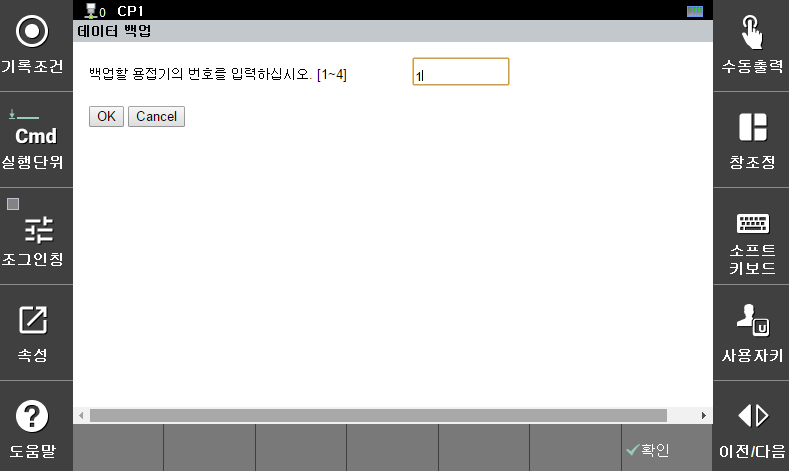

#### 6.2.1.2 데이터 백업

 

</img>
<em>
그림 6.6 데이터 백업
</em>

 

데이터 백업은 용접기의 설정 데이터를 ${cont_model} 제어기에 백업하고자 할 때 사용합니다. 데이터를 가져올 용접기의 번호를 입력하고, OK 버튼을 누르면 백업을 시작하며, 약 1~2분 정도의 시간이 소요됩니다. 데이터 백업이 완료되면, 정상적으로 데이터를 백업했습니다. 라는 메시지 창이 나타납니다.
백업한 데이터는 다음과 같은 경우에 유용하게 활용할 수 있습니다.  
 - ①	용접기의 설정 값을 백업해두고자 할 때,
 - ②	${cont_model} 제어기에 연결되어 있는 다른 용접기의 데이터를 변경하고자 할 때,
 - ③	다른 ${cont_model} 제어기에 연결되어 있는 용접기의 데이터를 일괄적으로 변경하고자 할 때
