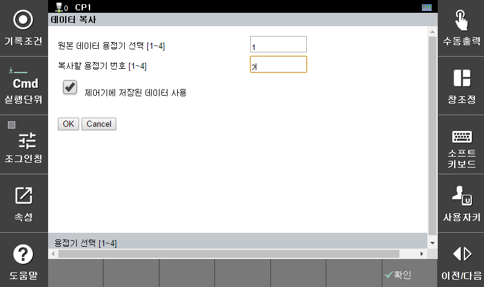

# 6.2.1.3 데이터 복사

 

</img>
<em>
그림 6.7 데이터 복사
</em>

 

데이터 복사는 한 용접기의 데이터를 다른 용접기의 데이터로 복사하는 기능 입니다. 또한, 제이거에 저장된 데이터 사용 체크박스를 사용하여 데이터 백업을 통해 저장한 데이터를 복사하는 기능도 제공합니다.
데이터 복사를 통해 복사되는 데이터는 PROGRAM 데이터이며, MONITOR 데이터는 해당되지 않습니다.

