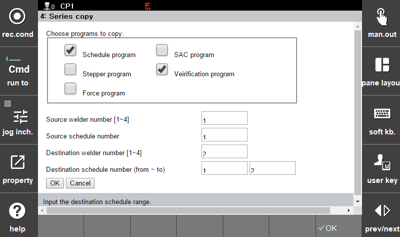

#### 6.2.1.4 Series Copy

 

</img>
<em>
Figure 6.8 Data Series Copy
</em>

 

The Series Copy function is used when you want to copy only the data that contains group (series) information.
From the programs shown in the screen, you can select the desired items and specify both the target welder and the group range to be copied.