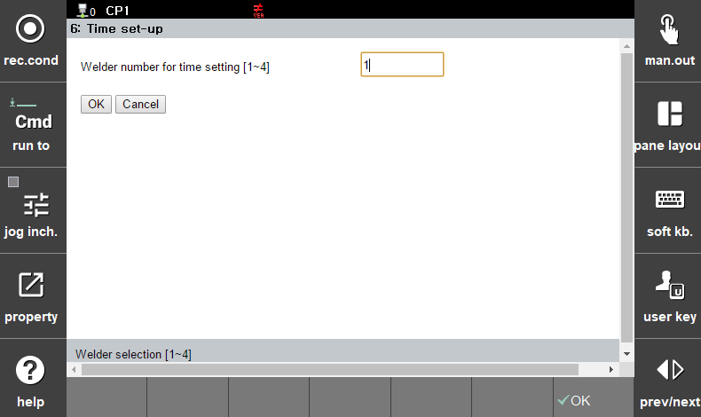

# 6.2.1.6 Time Synchronization

 

</img>
<em>
Figure 6.10 Welder Time Setting
</em>

 

This function is used to synchronize the welder's time with the robot controller by transferring the controller's current time to the welder.