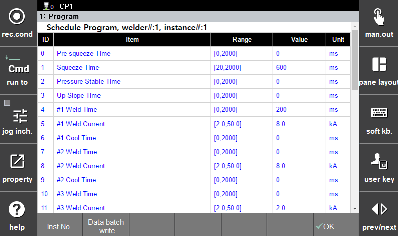

#### 6.2.2.3 Multi-Scheduled Program
 

</img>
<em>
Figure 6.14 Multi-Scheduled Program
</em>

 

A multi-scheduled program refers to a program in which the user can select a specific series.
In this case, the series can be selected using the `[Series Number]` button.

If you want to copy a specific single data item to a desired range of series, you can use the `[Batch Write Data]` button to access the batch write menu.