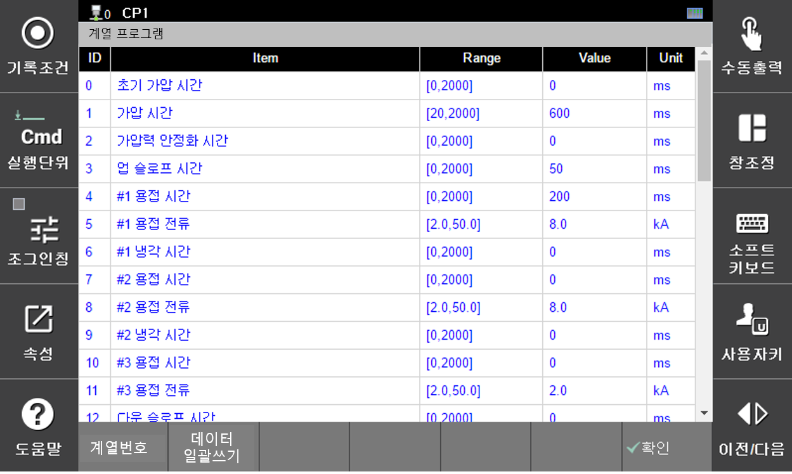

#### 6.2.2.3 다중 계열 프로그램

 

</img>
<em>
그림 6.14 다중 계열 프로그램
</em>

 

다중 계열 프로그램은 계열을 선택할 수 있는 프로그램을 의미합니다. 이 경우, 계열의 선택은 [계열번호] 버튼을 사용하여 할 수 있습니다. 그리고 특정 단일 데이터를 원하는 범위의 계열에 복사하고자 할 경우에는 [데이터 일괄쓰기] 버튼을 사용하여 데이터 일괄쓰기 메뉴를 활용할 수 있습니다.