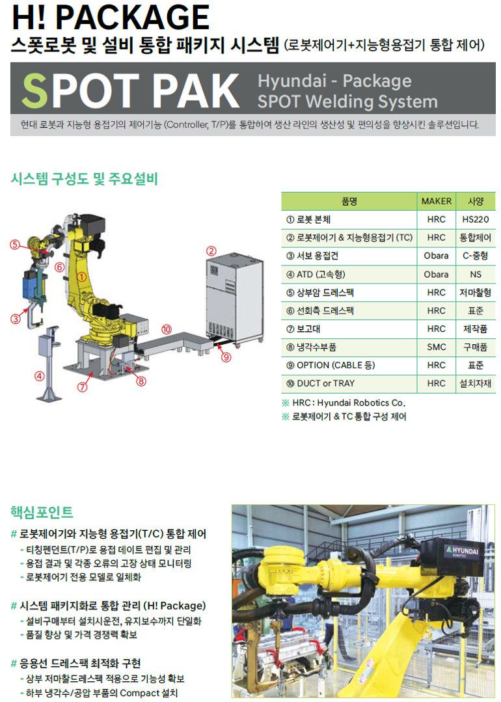
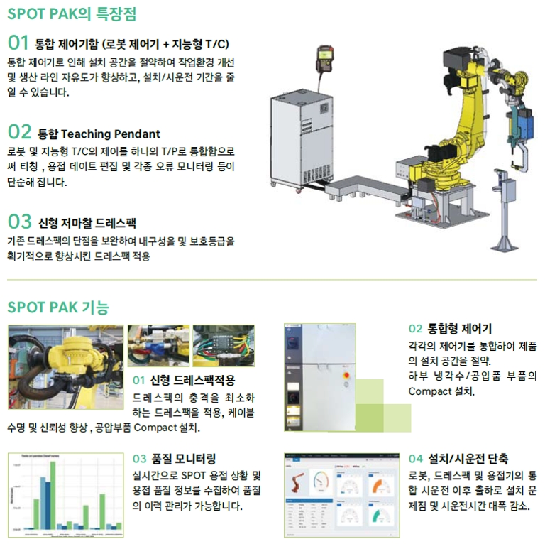

# 6. 스폿 패키지(spot-pak)

 

</img>
<em>

</em>

</img>
<em>
그림 6.0 스폿팩 소개지 중
</em>

 

스폿팩(spot-pak)은 현대로보틱스의 스폿 용접 통합 제어 시스템의 명칭입니다. 본 메뉴얼에서는 이 중 용접기와 인터페이스와 관련된 설정 및 TP 조작에 관해 설명합니다.

 


 * Hi6 V60.28 정식버전부터 사용가능합니다.
 * 현재 조웰, 오바라, 효성 3개의 용접기를 지원합니다. 
