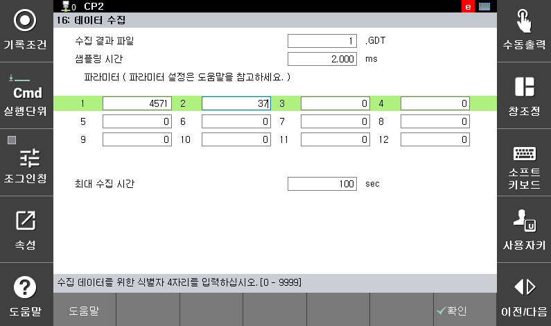
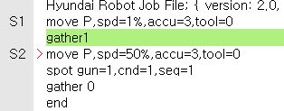
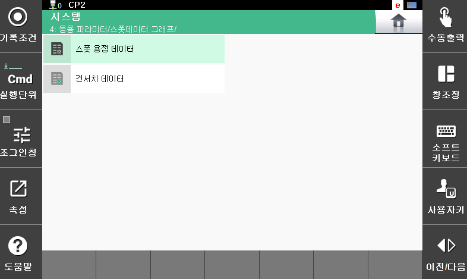
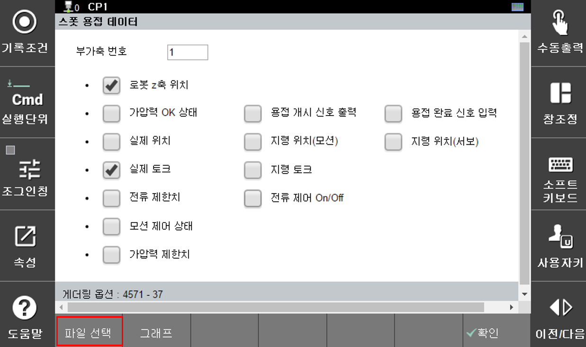
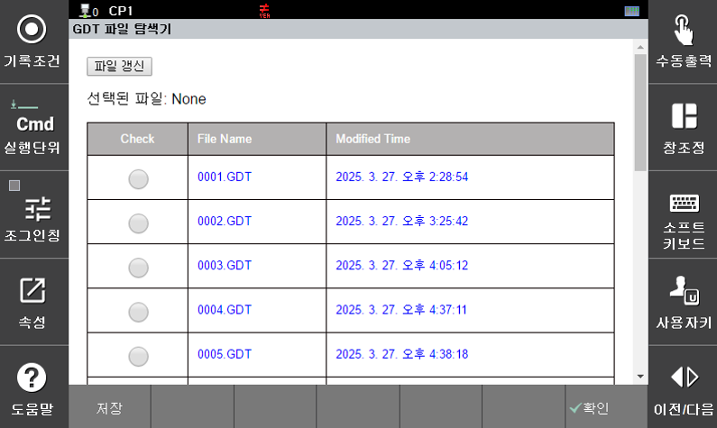
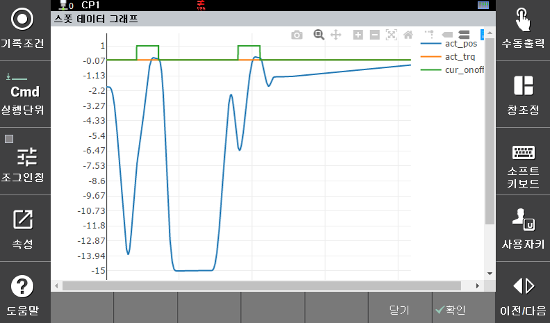
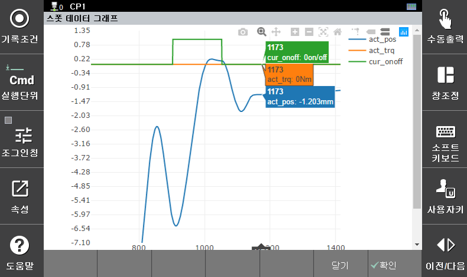

## 9.1 스폿 데이터 모니터링 기능

스폿 데이터 모니터링은 `spot` 명령을 수행하면서 생성되는 데이터들을 선택적으로 도표화 할 수 있습니다. 기존 게더링(gathering) 기능을 사용하여 데이터 수집을 만들고 이 파일을 활용하게 됩니다.

### - 데이터 파일의 생성

스폿 데이터 모니터링을 위한 데이터 수집을 위해 아래와 같이 옵션을 편집합니다. ([서비스 > 16: 데이터 수집], 엔지니어 모드)

</img>
<em>
그림 9.2 스폿데이터 수집 옵션 입력
</em>

 

사용자 프로그램에서 게더링 명령어를 수행합니다.

</img>
<em>
그림 9.3 게더링 명령어 수행
</em>

### - 데이터 파일 및 그래프 옵션 선택

스폿 데이터 모니터링 기능으로 진입하여 스폿 데이터 메뉴를 선택합니다.

</img>
<em>
그림 9.4 스폿데이터 그래프 메뉴
</em>

그래프 작성을 위한 옵션 선택 창과 하단 기능버튼이 표시됩니다. 

</img>
<em>
그림 9.5 그래프 작성 옵션 및 기능 버튼
</em>

[파일 선택] 버튼을 눌러서 저장된 GDT 파일 가운데, 그래프 작성을 원하는 파일을 선택하고 [저장] 버튼을 누릅니다.

</img>
<em>
그림 9.6 GDT 파일 선택
</em>

### - 그래프의 작성과 확대 기능
[그림  9.5] 의 기능 버튼 중에서 [그래프] 버튼을 누르면 아래와 같이 선택한 옵션에 대해 그래프가 표시됩니다.

</img>
<em>
그림 9.7 선택 항목의 그래프 작성
</em>

화면에서 자세히 보고자 하는 부분을 손이나 펜슬로 영역을 표시하시면 확대된 도표를 확인 할 수 있습니다.

</img>
<em>
그림 9.8 그래프 확대 기능
</em>

