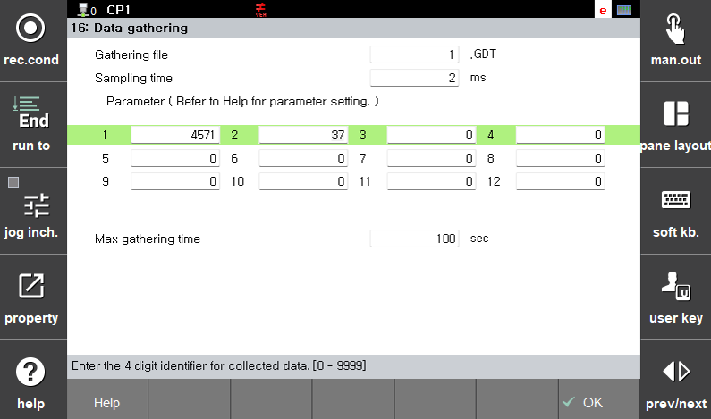
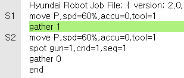
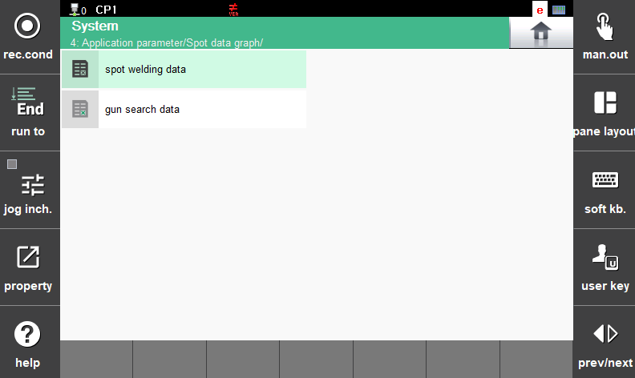
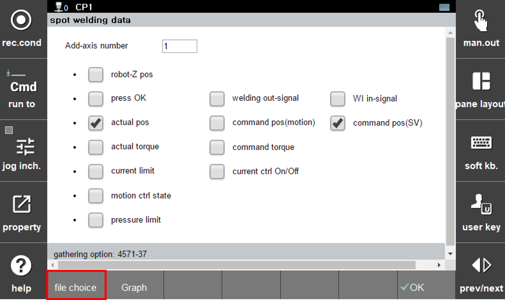
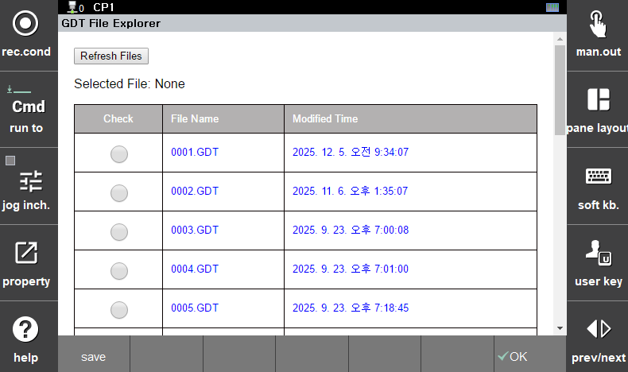
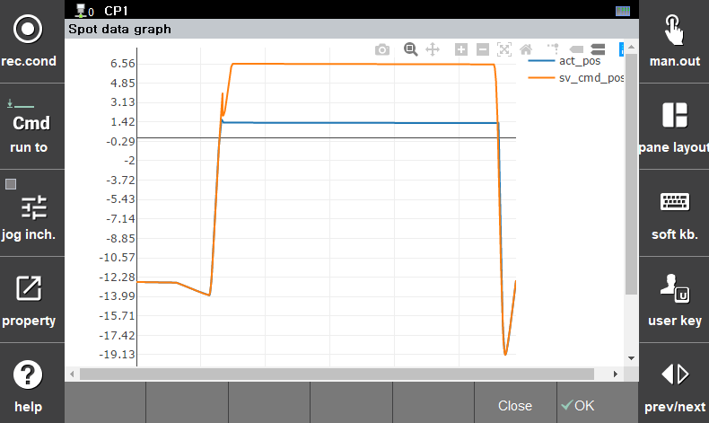
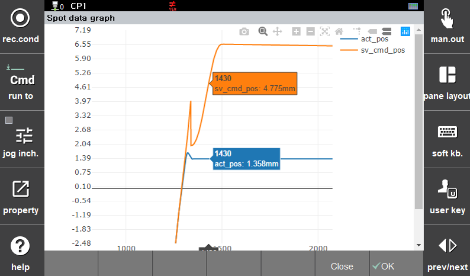

## 9.1 Spot Data Monitoring Function

Spot data monitoring allows selective visualization of data generated while executing the spot command. Data collection is created using the existing gathering function, and the generated data file is utilized for monitoring.

### Data File Creation

To collect data for spot data monitoring, edit the options as shown below:
([Service > 16: Data Gathering], Engineer Mode)

</img>
<em>
图 9.2 Spot 数据收集选项输入
</em>

 

Execute the gathering command in the user program.

</img>
<em>
图 9.3 执行数据收集命令
</em>

### - Data File and Graph Option Selection

Enter the Spot Data Monitoring function and select the Spot Data menu.

</img>
<em>
图 9.4 Spot 数据图表菜单
</em>

An option selection window for graph creation and function buttons at the bottom of the screen are displayed.

</img>
<em>
图 9.5 图表创建选项和功能按钮
</em>

By pressing the `[file choice]` button, select the GDT file to be used for graph generation from the saved files, and then press the `[save]` button.

</img>
<em>
图 9.6 GDT 文件选择
</em>

### - Graph Creation and Zoom Function
When the `[Graph]` button is pressed from the function buttons shown in Figure 9.5, graphs are displayed for the selected options as shown below.

</img>
<em>
图 9.7 选定项目的图表生成
</em>

To view details more closely, use a finger or stylus to select an area on the screen. The selected area will be displayed as an enlarged graph.

</img>
<em>
图 9.8 图表放大功能
</em>

