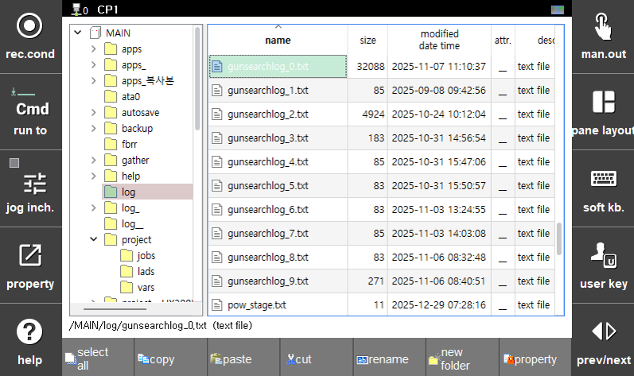

## 9.2 Gun Search Data History Management

No separate user procedure is required for gun search data history management. Each time the gunsea command is executed, the wear amount of each tip is automatically saved to a history file.

The files are stored under the 'MAIN > log' folder with the name gunsearchlog_x.txt, and up to 10 files are stored in a rotating manner.

</img>
<em>
Figure 9.9 Gun Search History Management Files
</em>

