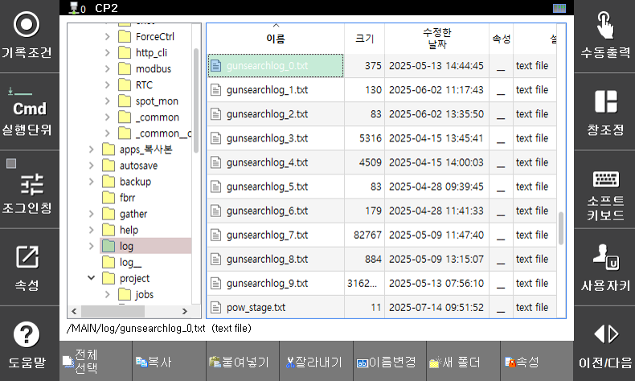

## 9.2 건서치 데이터 이력 관리

건서치 데이터의 이력관리 기능은 사용자가 별도로 수행해야하는 절차는 없습니다. 기존 `gunsea` 명령어 실행시마다 자동으로 히스토리 파일에 각 팁의 마모량이 저장됩니다. 'MAIN > log' 폴더 아래에 'gunsearchlog_x.txt'라는 이름으로 저장되며 최대 10개의 파일이 순환저장됩니다.

</img>
<em>
그림 9.9 건서치 이력 관리 파일
</em>

