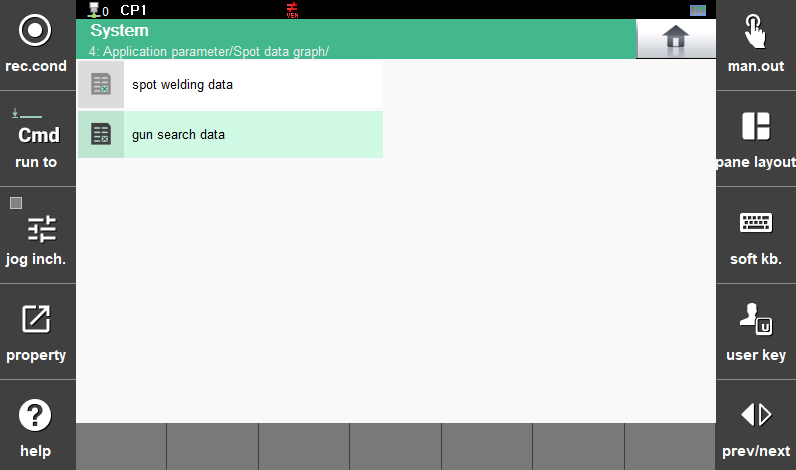
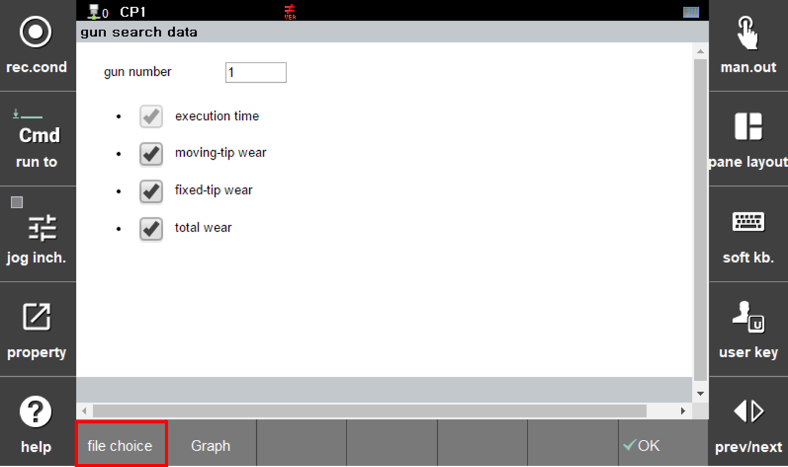
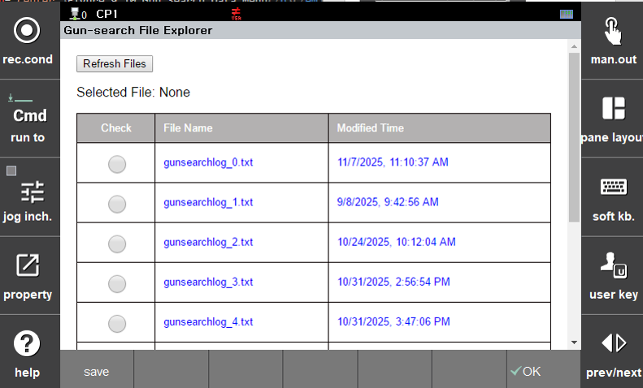
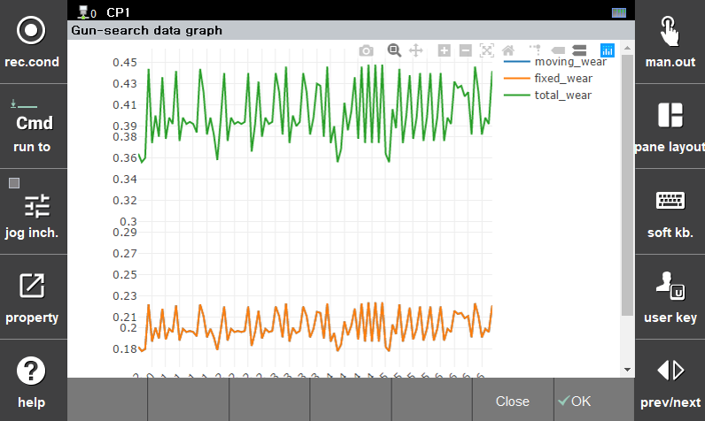

## 9.3 Gun Search Data Monitoring Function

By selecting a saved wear history file, users can view the trend of tip wear changes in graph form. To access this function, select the following menu item:

</img>
<em>
Figure 9.10 Gun Search Data Menu
</em>

### - Data File and Graph Option Selection

An option selection window for graph creation and function buttons at the bottom of the screen are displayed.

</img>
<em>
Figure 9.11 Graph Creation Options and Function Buttons
</em>

Click the [File Select] button, choose the desired log file from the saved files, and then click the [Save] button.

</img>
<em>
Figure 9.12 Log File Selection
</em>

### - Graph Creation and Zoom Function

Press the [Graph] button among the function buttons shown in Figure 9.5 to display graphs for the selected options, as shown below.

</img>
<em>
Figure 9.13 Graph Creation for Selected Items
</em>

