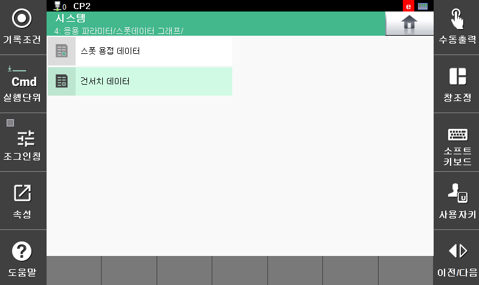
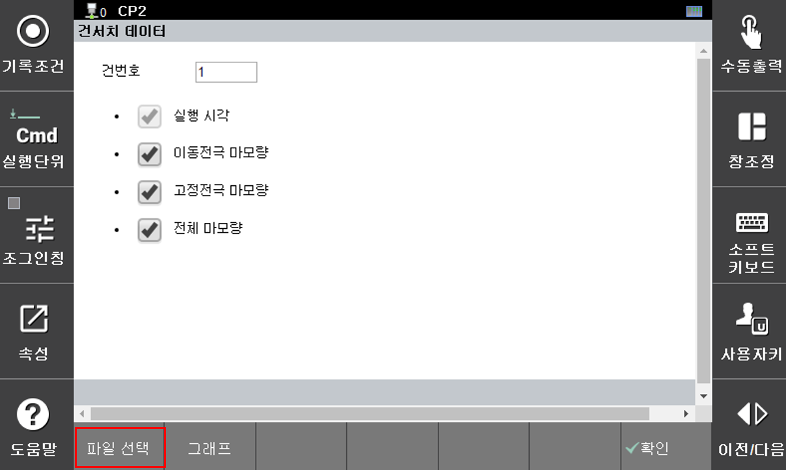
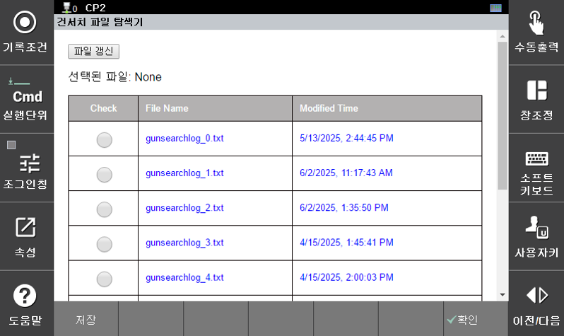
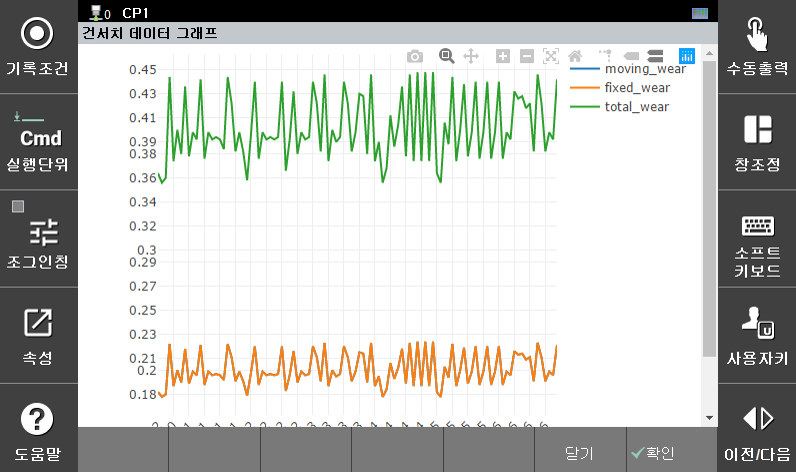

## 9.3 건서치 데이터 모니터링 기능

저장된 마모량 히스토리 파일을 선택하여 팁 마모량의 변동 과정을 도표로 확인 할 수 있습니다. 기능 메뉴는 아래 항목을 선택합니다.

</img>
<em>
그림 9.10 건서치 데이터 메뉴
</em>

### - 데이터 파일 및 그래프 옵션 선택

그래프 작성을 위한 옵션 선택 창과 하단 기능버튼이 표시됩니다. 

</img>
<em>
그림 9.11 그래프 작성 옵션 및 기능 버튼
</em>

[파일 선택] 버튼을 눌러서 저장된 GDT 파일 가운데, 그래프 작성을 원하는 파일을 선택하고 [저장] 버튼을 누릅니다.

</img>
<em>
그림 9.12 로그 파일 선택
</em>

### - 그래프의 작성과 확대 기능
[그림  9.5] 의 기능 버튼 중에서 [그래프] 버튼을 누르면 아래와 같이 선택한 옵션에 대해 그래프가 표시됩니다.

</img>
<em>
그림 9.13 선택 항목의 그래프 작성
</em>

