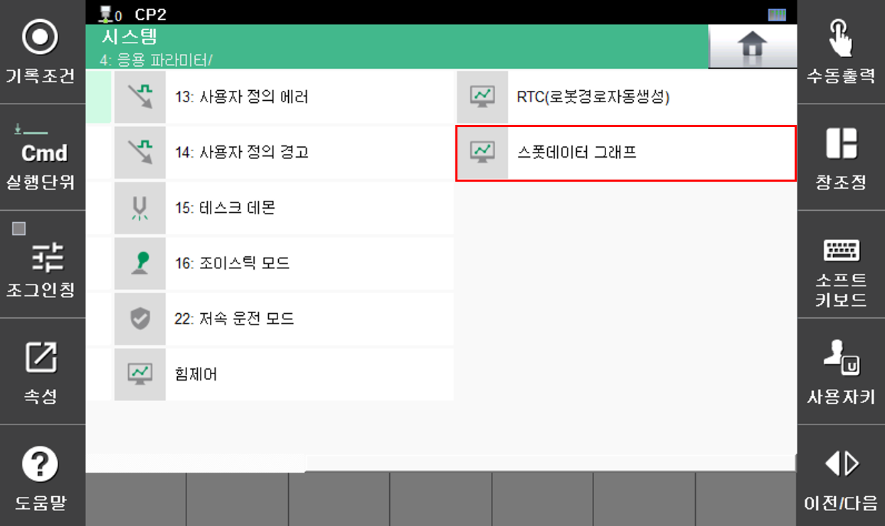

# 9. 스폿 모니터링 기능

스폿 모니터링 기능은 스폿 용접을 실시하면서 생성 되는 데이터들을 그래프로 가시화하여 문제가 발생한 경우에 그 원인을 신속히 파악할 수 있도록 지원합니다. 또한, 기능을 확인하고자 하는 경우에는 그래프로 표시되는 각 데이터들의 크기와 타이밍을 검토하여, 데이터 파일을 PC에서 분석하는 번거로움없이 TP에서 바로 정상, 비정상 여부를 판별하는데 도움을 주는 기능입니다. 

## 설치 방법
본 기능은 플러그인(flug-in) 방식으로 개발되어, 별도의 빌드 과정 없이 해당 코드를 지정된 폴더에 저장하면 자동으로 메뉴가 표시되고 원하는 기능을 선택하여 실행할 수 있습니다. 플러그인 프로그램의 설치 및 보안에 대한 기능이 별도로 제공되기 전까지 스폿 담당자로부터 소스 코드를 받아서 [MAIN > apps > spot_mon] 경로에 복사하시면 됩니다. 이 후 [시스템> 4:응용 파라미터] 항목에 해당 기능의 메뉴가 생성됩니다.

 

</img>
<em>
그림 9.1 스폿데이터 모니터링 기능 메뉴
</em>

