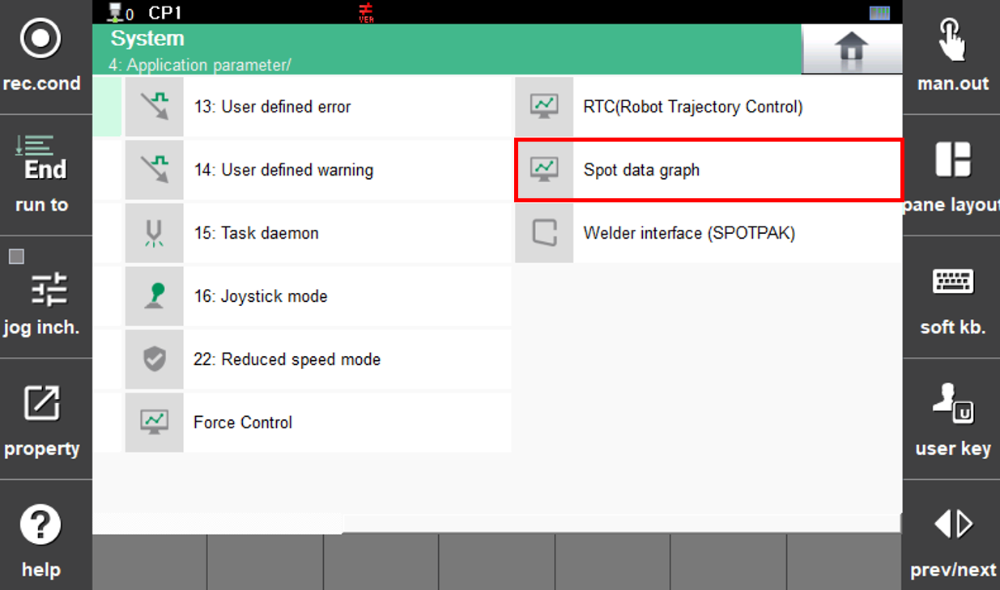

# 9. Spot Monitoring Function

The Spot Monitoring function visualizes data generated during spot welding in graph form, enabling rapid identification of the root cause when a problem occurs. In addition, when checking function behavior, users can review the magnitude and timing of each data item displayed in the graph, helping to determine normal or abnormal conditions directly on the TP without the inconvenience of analyzing data files on a PC.

## Installation Method

This function is developed using a plugin-based approach. By simply saving the corresponding code to the designated folder, the menu is automatically displayed without requiring a separate build process, allowing users to select and execute the desired function.

Until dedicated features for plugin program installation and security are officially provided, obtain the source code from the spot welding developer (spot function administrator) and copy it to the following path:

[MAIN > apps > spot_mon]

 

</img>
<em>
Figure 9.1 Spot Data Monitoring Function Menu
</em>

